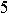

DecodeValidateCode
==================

An simple example in python to show how to decode validate code.

# The basic case

As you seen it's a simplest case which contains four decimals.

The solution can be described to three steps: *binary*, *devide*, *recognize*.
## 0)Prepare types
This is a preparation step, so we called it step Zero. In this step we need to make all of possible occurs character to be a seperated image file.

## 1)Binary
In this step we will transform the origin image into a black and white image. The theory is the color is consist of RGB three basic colors, so we can set a global threshold to do the binary operation. 
## 2)Devide
In this step we will split the image into four parts, each part contains a decimal.
## 3)Recognize
In this step we wiil take each piece of our four parts to compare to the types we made in step zero and find the most similar one, and then we will know what character it is. After we done four parts we just need to join the four characters into one word and we got the anser.